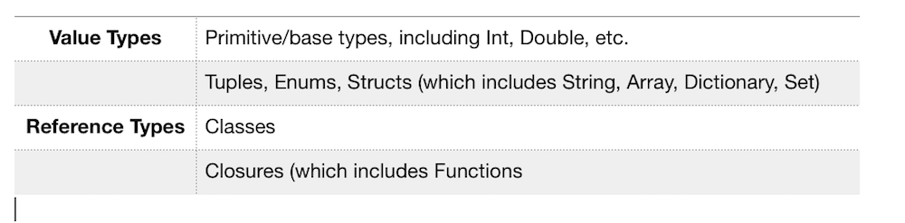
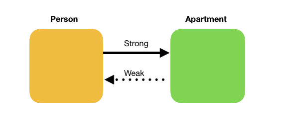

# Memory Management

## Minute-by-Minute

| **Elapsed** | **Time**  | **Activity**                        |
| ----------- | --------- | ----------------------------------- |
| 0:00        | 0:05      | Objectives                          |
| 0:05        | 0:05      | Initial Exercise                    |
| 0:10        | 0:15      | Allocation/Deallocation             |
| 0:25        | 0:10      | In Class Activity I                 |
| 0:35        | 0:20      | Automatic Reference Counting (ARC)  |
| 0:55        | 0:10      | BREAK                               |
| 1:05        | 0:20      | In Class Activity II                |
| 1:25        | 0:05      | Closures and Reference Cycles       |
| 1:30        | 0:20      | In Class Activity III               |
| 1:50        | 0:10      | Wrap Up                             |
| TOTAL       | 2:00      |                                     |

## Why you should know this

The key to developing high-performance iOS apps is to know how your components consume memory and how to optimize memory use.

Poor optimization can result in code issues, including memory leaks and potentially fatal errors.

***Important Note:*** *iOS keeps track of how much memory each app uses on a given device, and it is set up to kill apps that consume too much.*

## Class Learning Objectives/Competencies (5 min)
At the end of this class, you should be able to...

1. Explain how memory management works in Swift, including when and why to use *strong*, *weak*, or *unowned*
2. Identify and resolve *strong reference* cycles (aka, retain cycles)
3. Demonstrate proficiency in using built-in tools and techniques to find memory leaks caused by retain cycles

## Initial Exercise (5 min)

In pairs, briefly discuss with your partner your initial, top-of-mind responses to these common interview questions:

1. When and why would you use the keyword *weak*?
2. What is a *retain cycle*? Can you give examples of when a retain cycle might occur?
3. In Swift, is memory management for *value types* the same as memory management for *reference types*?
4. What is the default attribute declared for an @IBOutlet: *weak* or *strong*? Why?


## Memory Allocation/Deallocation  (15 min)

### Memory Leaks, Reference Counting, and Retain cycles

#### Memory Leaks

A memory leak occurs when an instance of a reference type remains in memory even after its lifecycle has ended.

Leaked memory still counts as a portion of an app’s total memory, even though the objects causing the leaks are no longer needed or useful.

#### Value Types

When you create a new instance of a *value type*, the right amount of memory is set aside for it. Whenever you do anything with it, Swift creates a copy of it.

When that instance no longer exists, Swift automatically reclaims its allocated memory.

In Swift, you do not need to anything to manage memory used by value types.

*Below is a general list of Value and Reference Types in Swift. To learn more, see the ARC section of the Functions Closures and ARC playground from previous lessons, or browse the topic on the Web.*



#### Reference Types

But passing around an instance of a *reference type* (class, closure) or storing it as a property does not copy it — it creates an additional reference to the same instance.

In other words, you are creating an additional reference to the same memory location on the heap.

**Q:** If there are multiple references to the *same* instance of a class (object), what is the impact to all its references if any single reference makes a change to it?

#### Reference Counting

Every class instance has a reference count — the number of references to the actual memory on the heap allocated for that instance.

As long as an instance’s reference count is greater than 0, the instance remains alive, and its memory will not be reclaimed.

##### Using the `deinit()` Function
Recall from Lesson 4 that a `deinit()` function is called immediately before a class instance is deallocated. Thus, you can use this function to perform clean up or other actions just before the instance is deallocated.

As soon as the instance's reference count becomes 0, its `deinit()` function will run, and its memory will be deallocated.

The *deinit()* function in the following example from [Apple](https://docs.swift.org/swift-book/LanguageGuide/Deinitialization.html#//apple_ref/doc/uid/TP40014097-CH19-XID_182) uses a gaming metaphor to illustrate how `deinit()` can be used to manage the behavior of reference type instances just prior to their deallocation.  

When the reference count of an instance of the Player class becomes 0, its coins are returned to the Bank immediately before the instance is removed from memory.


```Swift
struct Bank {
    static var coinsInBank = 10_000
    static func vendCoins(var numberOfCoinsToVend: Int) -> Int {
        numberOfCoinsToVend = min(numberOfCoinsToVend, coinsInBank)
        coinsInBank -= numberOfCoinsToVend
        return numberOfCoinsToVend
    }
    static func receiveCoins(coins: Int) {
        coinsInBank += coins
    }
}

class Player {
    var coinsInPurse: Int
    init(coins: Int) {
        coinsInPurse = Bank.vendCoins(coins)
    }
    func winCoins(coins: Int) {
        coinsInPurse += Bank.vendCoins(coins)
    }
    deinit {
        Bank.receiveCoins(coinsInPurse) // Coins are returned to the Bank just prior to Deallocation
    }
}
```

**Note:** The `deinit()` function is also useful in identifying possible memory leak situations caused by strong reference cycles...


## In Class Activity I (10 min)

Part 1 - Individual
1. Download the starter app, [LeakyStarship](https://github.com/VanderDev1/LeakyStarship)
2. Find one of the three (3) `deinit()` functions in the app.
3. Set a breakpoint that will stop at one of the `deinit()` functions
3. Run the app, click the button on main scene, and examine what happens at each breakpoint
(When done, disable all breakpoints)

Part 2 - In Pairs
1. Discuss with your partner what occurred at each `deinit()` breakpoint and why?


## Automatic Reference Counting (ARC) (20 min)

In 2011, Apple introduced Automated Reference Counting (ARC) for Objective-C.

Swift is built on top of ARC.

With ARC, the compiler is now responsible for analyzing your code and for managing reference counts of class instances — so you do not have to.

However, because Swift handles memory automatically, it is still critical to understand how iOS manages memory, as there are some common mistakes that can cause memory issues…

## Strong Reference Cycles (10 min)

### Strong References & Ownership

A strong reference increments the reference count of the instance to which it points. When one instance of a reference type (RefA) has a reference to another (RefB), we say that RefA is an “owner” of RefB.

By retaining a reference to RefB, RefA protects RefB from being deallocated by ARC.


By default, all references you create are strong references.


### Strong Reference Cycles

If two reference types each hold strong references to each other — if RefA retains a reference count for RefB, and RefB also retains RefA — they have a strong reference cycle (aka, a retain cycle).


Strong reference cycles are one type of memory leak.

A Simple Example - An instance of the Person class will have a strong reference to an instance of the Apartment class, and the Apartment class instance will also have a strong reference to the instance of the Person class. Neither instance's reference count can ever be 0.

```Swift
class Person {
    var apartment: Apartment?
    }

class Apartment {
    var tenant: Person?
}
```

## How to Break Strong Reference Cycles (10 min)

### Weak & Unowned References

#### Weak References

A variable marked with the *weak* keyword does not take ownership of the object it refers to — it does not increment the reference count of its referenced object.

In the example above, if we add the *weak* attribute to the Apartment variable in the Person class, and the Apartment instance is successfully deallocated, the Person class's reference to it will now be `nil`.

As a *weak* variable, Person does not protect Apartment from being deallocated by ARC.



This ensures that when you access a weak reference, it will either be a valid object, or `nil`.

```Swift
class Person {
    weak var apartment: Apartment?
    }

class Apartment {
    var tenant: Person?
}
```


Because weak references can be changed to `nil` if the instance they point to is deallocated, they come with two inherent requirements:

- Weak references must always be declared as Optional, since Optionals are the only types that can become `nil`.

- Weak references can never be declared as `let`. Instances declared as `let` cannot change, thus weak references must always be declared as var.

**Q:** Where or when have you seen the `weak` keyword used so far in your iOS work?

#### Unowned References

Like a weak reference, an unowned references does not increase the retain count of the object it references.

Unlike a weak reference, however, an unowned reference is assumed to always have a value — it behaves somewhat like an implicitly unwrapped optional.

Because of this, an unowned reference is always defined as a non-Optional type. An unowned reference *cannot* be `nil`.

This makes them easier to manage rather than resorting to using optional binding.
*However, if you try and access an unowned reference, and it’s not there, it will crash the app.*


## In Class Activity II (20 min)

**Requirements:** The [LeakyStarship](https://github.com/VanderDev1/LeakyStarship) starter app

Individual
1. Follow the steps in the [Using the Debug Memory Graph Tool](https://github.com/Make-School-Courses/MOB-1.3-Dynamic-iOS-Apps/blob/master/Lessons/Lesson5/Mem_Graph_Tutorial/MemGraphTutorial.md) tutorial to find and fix memory leaks...

**Q** In addition to adding the *weak* keyword, what other change was required?
- why?


## Closures and Reference Cycles (5 mins)

By default, captured values in closures are strong references.

Because closures — like classes — are reference types, a strong reference cycle can also occur with a closure if you assign it to a property of a class instance, and the body closure captures a reference to that class instance.

```Swift
func addScore(_ points: Int) -> Int
{
    let score = 42 // capture-able value in closure's surrounding context

    let calculate = { // closure
        return score + points
    }

    return calculate()
}
```

## In Class Activity III (20 min)
**Requirements:** The [LeakyStarship](https://github.com/VanderDev1/LeakyStarship) starter app

Individual
1. Part of an iOS developer's "toolkit" is the ability to quickly find the most useful information from Internet research.
- Using the tools and knowledge you've experienced in this class, **find and fix the memory leak** in the Starship class (hints: there is a **closure** involved - *find out how closures can cause strong reference cycles and how to resolve them*)


## Wrap Up (10 min)

1. **Role Play Exercise** - A Mini Practice Interview
- Pair up. For 3 to 5 minutes in each role, take turns playing (a) a Hiring Manager, then (b) a Candidate for an iOS developer position.
- As the Hiring Manager, ask your Candidate to answer each of the questions from the Initial Exercise above.

2. Complete Challenges

3. Read content listed below for clarity on the topics relevant to iOS Memory Management covered in this class.

## Challenges

-- REQUIRED --
1. Look up *weak* and *unowned*:
- How are they similar? How do they differ?
- When would you use one over the other?
2. In a fresh (leaky) version of the LeakyStarship app, use the Memory Graph Tool to examine the two `ContiguousArrayStorage` objects:
- Research why these objects are causing memory leaks
- Resolve those leaks
3. Use the **Instruments -> Leaks** tool to identify memory leaks:
- Execute this [Instruments tutorial by Ray Wenderlich](https://www.raywenderlich.com/397-instruments-tutorial-with-swift-getting-started)
- Apply what you have learned in the above tutorial to the original (leaky) version of LeakyStarship to find and fix its leaky CrewMember objects

-- OPTIONAL --

4. What are the defaults (*weak*, *strong*, *unowned*) for the following constructs? What is your guess as to why Apple chose those defaults for each construct?
- Arrays?
- @IBOutlets?
- Closures?
5. Research how the `isKnownUniquelyReferenced(_:)` function can be used to guard against creating retain cycles
- Using a fresh version of the LeakyStarship app, implement the `isKnownUniquelyReferenced(_:)` function to find memory leaks


## Additional Resources
- [Slides](https://drive.google.com/open?id=1TVRPRTP3KguK0HHIGitffBEW-2ojjjaAQPc4Mpk84Mg)
- [Strong, Weak & Unowned - an article](https://krakendev.io/blog/weak-and-unowned-references-in-swift)
- [Avoiding Retain Cycles - an article](https://medium.com/mackmobile/avoiding-retain-cycles-in-swift-7b08d50fe3ef)
- [Deinitialization - from Apple](https://docs.swift.org/swift-book/LanguageGuide/Deinitialization.html#//apple_ref/doc/uid/TP40014097-CH19-XID_182)
- [Reference Types & Value Types in Swift - an article](https://www.raywenderlich.com/9481-reference-vs-value-types-in-swift)
- [Deinitialization to Deallocate Memory Space - a tutorial from tutorialspoint.com](https://www.tutorialspoint.com/swift/swift_deinitialization.htm)
- [Manual Memory Management in iOS (Pre-ARC) - article](https://www.tomdalling.com/blog/cocoa/an-in-depth-look-at-manual-memory-management-in-objective-c/)
