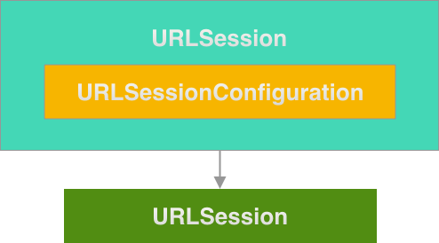
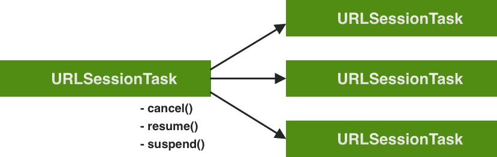
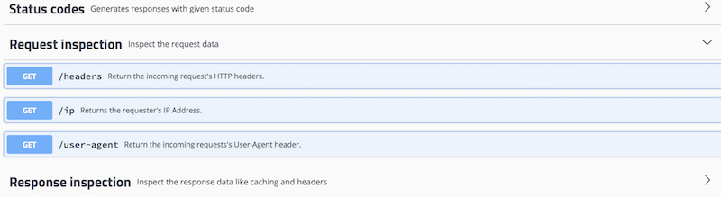

# Network Requests with URLSession

## Minute-by-Minute

| **Elapsed** | **Time**  | **Activity**                        |
| ----------- | --------- | ----------------------------------- |
| 0:00        | 0:05      | Objectives                          |
| 0:05        | 0:05      | Class Handouts                   |
| 0:10        | 0:15      | Initial Exercise                    |
| 0:25        | 0:20      | URLSession - An Overview             |
| 0:45        | 0:10      | BREAK                               |
| 0:55        | 0:25      | In Class Activity I                 |
| 1:20       | 0:15      | Validate and Process the Response  |
| 1:35        | 0:20      | In Class Activity II                |
| 1:45        | 0:05      | Wrap Up                             |
| TOTAL       | 1:50      |                                     |


## Why you should know this
Nearly every serious iOS app communicates at some point with an Internet component such as a remote web service.

Fetching and processing data between an app and a web service is an essential skill that all iOS developers must master.

And the most commonly-used protocol for communicating with web servers is **HTTP** (and its secure counterpart, HTTPS).

Since iOS 7, Apple has provided **URLSession** and its suite of related components as **a complete networking API** for uploading or downloading content via **HTTP** and HTTPS.

<!--
...and its family of related classes...

**HTTP** and **HTTPS** are robust and stable protocols. They have been widely used in web browsers for a long time. They offer several performance and security advantages, as well as a mature base of easy-to-use development and analysis tools.

to make GET and POST network requests...
-->


## Class Learning Objectives/Competencies (5 min)
At the end of this class, you should be able to...

1. Implement a simple HTTP-based request to a public Internet API using the primary components of the URLSession framework.
2. Use Xcode's built-in features to research properties and behaviors of Foundation framework data types (e.g., URLSession classes, methods and properties).
3. Validate HTTP response data and guard against common HTTP error conditions.
4. Display text and images fetched from free web services.
5. Use JSONSerialization to convert binary Data objects into JSON data.

## Class Handouts (5 min)

### Structured Sharing Exercise - Part 1

By the end of class, write down your **three (3) most important** responses for each of the question sheets passed out.


## Initial Exercise (15 min)

What differentiates software developers from other engineers?

    Developers find things out.

We’ve learned that executing efficient **Internet searches** is a key skill every iOS developer needs.

We also have - at our fingertips — an extremely powerful tool for "finding things out": **Xcode**

### Xcode Techniques  

Xcode offers a wealth of insight into most of the Swift and iOS constructs we need to know to get the job done.

#### TODO: In Pairs (3 to 5 mins)

Resources needed:
* The [DailyPlanet](https://github.com/VanderDev1/DailyPlanet) starter app
* **Xcode**

1. Share your favorite Xcode techniques for finding out the capabilities, behaviors and requirements of these iOS networking constructs found in the **DailyPlanet** starter app:
* `URLSession`
* `URLRequest`
- `SessionDataTask`
- `.resume()`


<!-- Add graphic and/or code samples -->

2. Briefly share with each other any other tips on how to use built-in Xcode features to work more efficiently. Ideas could include:
* how to navigate around your code
* how to debug behaviors in your own code (i.e., using `p` or `po`, `print()` statements, and so on)

#### TODO: As A Class (3 to 5 mins)

1. Volunteers share the most useful techniques learned

##### Key Questions:
 - [ ] **Q:** What does `.resume()` do?</br>
 - [ ] **Q:** When does the `.resume()` function execute?

<br />


## URLSession - An Overview (20 min)

`URLSession` is the **key object** responsible for sending and receiving HTTP requests. It natively supports the data, file, ftp, http, and https URL schemes.

It creates an object that coordinates a group of related network data transfer tasks.</br></br>

 </br>


**Important Note:** *Like most networking APIs, the URLSession API is highly asynchronous. See* Additional Resources *below for more info.*


### URLSessionConfiguration

Every URLSession instance is initialized using an `URLSessionConfiguration object`, which defines the behavior and policies to use when uploading and downloading data.

URLSessionConfiguration will also let you configure additional HTTP headers, timeout values, caching policies, and other session properties.

#### Three types:

URLSessionConfiguration objects come in 3 flavors:

1. **.default** - Creates a default configuration object that uses the disk-persisted global cache, credential and cookie storage objects. Can save cache or cookies to disk, credentials to the Keychain.
2. **.ephemeral** - Similar to `.default`, but all session-related data is stored in memory and will be gone once the session terminates.
3. **.background** -  Allows the session to perform upload or download tasks in the background, even if the app is suspended.

Here is a simple example of a declaration of a `URLSession` instance using the `.default` `URLSessionConfiguration` type:

``` Swift
let defaultSession = URLSession(configuration: .default)
```

### URLSessionTask

To do the real work of fetching data or downloading/uploading files, a session creates one or more *tasks.*

`URLSessionTask` is the *abstract class* which contains predefined network task behaviors.

#### Three types:
The three concrete subclasses of URLSessionTask which you will employ most often are:

1. **URLSessionDataTask** - Intended for short, often interactive server requests such as fetching data by sending HTTP requests (GET, POST, etc). Data tasks send and receive data using `NSData` objects.
2. **URLSessionUploadTask** - Similar to data tasks, but also send data (such as a file) from disk to web service, and they support background uploads while the app is no longer running.
3. **URLSessionDownloadTask** - Data from a remote service is retrieved in the form of a file and stored in a temporary location. Supports background downloads/uploads while app the isn't running.

*Diagram illustrating the relationship between the abstract parent class, URLSessionTask, and its 3 concrete implementations, along with a few of the functions inherited from the abstract parent class:*

 </br>


<!--  TODO: code samples here -->


<br>

<!-- ### The `.resume()` Function -->

<!-- Response data? - can be accessed via delegate of completion block -->

## Making HTTP GET Requests Using URLSessionDataTask

The following steps show how to create, send and validate a simple HTTP GET request using a `URLRequest` object and a `URLSessionDataTask` instance that returns its `URLResponse` via a `completion handler.`

### 1. Configure the Session

Configuring your `URLSession` object can be as simple as writing a single-line declaration, or you can specify a complex set of conditions and parameters to control your session's state and behavior.

The following code illustrates a complex set of configuration parameters applied to a session defined as a `.background` session:

``` Swift
private lazy var urlSession: URLSession = {
    let config = URLSessionConfiguration.background(withIdentifier: "MySession")
    config.isDiscretionary = true
    config.sessionSendsLaunchEvents = true
    return URLSession(configuration: config, delegate: self, delegateQueue: nil)
}()
```

For this lesson, we will only work with a simple, one-line `.default` session configuration:

``` Swift
let defaultSession = URLSession(configuration: .default)
```

### 2. Set Up the Request

#### Create the URL Object

The `URL` class defines a local or remote [URI](https://en.wikipedia.org/wiki/Uniform_Resource_Identifier). It could be a link to a remote HTML webpage, a local file accessed using `file:///` or any other item qualifying as a `URI.`

``` Swift
        // Create URL
       let url = URL(string: "https://<your_target_web_service>")
```

#### Create the URLRequest Object

Though it is possible to send a very simple request, the `URLRequest` object properly represents a URL and offers configuration parameters for setting the request's body, headers, and access method (GET, POST, etc).

There are various constructor signatures available for creating `URLRequest` objects. This one only requires a valid URL object as its single argument:

``` Swift
    // Create Request
    let request = URLRequest(url: url!)
```
**Note:** *The URL passed into `URLRequest(url: url!)` is forced unwrapped in case an invalid URL string was provided (for example, `htp:/a.2.3`)*

### 3. Make the Request

#### The Data Task

To make a request, you create an instance of the `URLSessionDataTask` class, pass it your `URLRequest/URL,` and call its `completion handler.`

``` Swift
  ...
  // Create Data Task
  let dataTask = defaultSession.dataTask(with: request, completionHandler: { (data, response, error) -> Void in

    // handle Response Here

    })
  ...
```

The `completion handler` is a closure that is executed when your data task is finished and the response to your request has been returned.

**Note:** *Using a completion handler on completion of a data task is only 1 of the 2 ways URLSession can return data. The other way to return data from a URLSession request requires calling methods on an instance of the `URLSessionDelegate` when creating the session.*


##### The Objects Returned

Let's take a moment to examine the `data,` `response,` and `error` objects returned when the data task's completion handler finishes:

``` Swift

  let dataTask = defaultSession.dataTask(with: request, completionHandler: { (data, response, error) ->
  ...

```

- `data` - Is an object of type `Data` (aka, `NSData`). NSData objects encapsulate data in a binary format. To manipulate or present its contents, we will have to convert it to a more human-readable format (i.e, JSON).
- `response` - Is of type `NSHTTPURLResponse,` which is a subclass of `URLResponse.` It contains useful data about the response itself that often comes in handy when analyzing success or failure of a specfic request.
- `error` - Behind this object is a simple `enum` listed in the official framework docs as "A type representing an error value that can be thrown." If the request is *not* successful, this `error` object will be passed to the completion handler. When the request is successful, this will be `nil.` *(Though we'll see later that the request can still fail, at some level, even if the `error` object is `nil` after the data task completes.)*


#### The .resume() function

At this point, your network request has only been set up. To execute it, you'll need to start it.

By **default**, Apple has set up all newly-initialized tasks to begin in a **suspended state.** So you need to call the `.resume()` function on a task in order to start it.

#### The Full Request

Except for handling the response, this code snippet depicts the complete set of steps required to make our simple GET request:

``` Swift

  func someDataFetchFunction() {

        // Configure a .default session
        let defaultSession = URLSession(configuration: .default)

        // Create URL
        let url = URL(string: "https://<your_target_web_service>")

        // Create Request
        let request = URLRequest(url: url!)

        // Create Data Task
        let dataTask = defaultSession.dataTask(with: request, completionHandler: { (data, response, error) -> Void in

          // handle Response Here

        })
        dataTask.resume() // Start the data task
    }
```

### 4. Handle the Response

When the `completion handler` closure is executed, you can validate the data returned and process it for presentation to the user, or whatever your app needs to do with it.

#### URLResponse Object

The counterpart to the URLRequest object, the `URLResponse` object is returned when the `completion handler` closure successfully executes.

It contains valuable info about the response returned, including:
- the HTTP Status Code
- the HTTP headers


### 5. Present Results  

Typically, you will want to process and present the JSON data returned from the GET request.

But before we examine how to *serialize/deserialize* the JSON object returned, we'll simply use `print()` statements to examine and confirm what is returned from our request.

``` Swift

  // Create Data Task
     let dataTask = defaultSession.dataTask(with: request, completionHandler: { (data, response, error) -> Void in

         print("data is: ", data!)
         print("response is: ", response!)

     })
```

Once we are clear on the steps required to process the returned JSON data, we will be set up to present our returned data to the user...


## In Class Activity I (25 min)

For this exercise we will use these 3 resources:
1.  httpbin.org's [public API tester](https://httpbin.org/#/Request_inspection/get_headers)
2. Nasa's public [Astronomy Picture of the Day API](https://api.nasa.gov/api.html)
3. The [DailyPlanet](https://github.com/VanderDev1/DailyPlanet) starter app

**Part 1 - Individual**

Using the `Request inspection` endpoint on httpbin.org's tester page, we will send a `GET /headers` *request* that will return the `request's HTTP headers` in its `Response body`.

 </br>


1. First, examine httpbin.org's exceptional, easy-to-use [web service testing interface](https://httpbin.org) in a web browser on your laptop.
2. Next, expand the *Request inspection* dropdown and its *GET /headers* function. Press the `Try it out` and `Execute` buttons. In the *Responses* fields returned, pay particular attention to the `"headers":` node in the *Response body* field. Also notice the HTTP status code returned (success = 200).

*(Feel free to experiment a little with this interface when you have time.)*


**Part 2 - Individual**

1. Download and run the [DailyPlanet starter app](https://github.com/VanderDev1/DailyPlanet). *(Don't worry if the main scene is a blank screen - we'll improve on that later!)* </br>
2. Study the construction of its `fetchHeaderData()` function.</br>
3. Compare your debug output with the results of same *GET /headers* request executed from your web browser.

<!-- Add graphic and/o code samples -->


**Part 3 - Individual**

**TODO:** Using the URLSession implementation steps covered so far, complete the implementation of the `fetchNasaDailyImage()` in the starter app and present Nasa's Astronomy Picture of the Day to your users.

**NOTES:**
1. At the time of this writing, NASA's pic of the day was:
https://apod.nasa.gov/apod/image/1902/FoxFur_new_color_2048px.jpg

2. To get the latest pic of the day:
- Launch the demo URL in your browser -- this will only return **metadata** for NASA's pic of the day:
https://api.nasa.gov/planetary/apod?api_key=DEMO_KEY
- in the metadata returned, find the `hdurl` node and copy it into your iOS project

*For clues, see the URLSession implementation details of the `fetchHeaderData()` function.*

**Part 4 - As A Class**

  Briefly discuss..

**Q:** What is the essential nature (data type) of each of the 3 objects returned when the `completion handler` executes?

- the `response` object?
- the `data` object?
- the `error` object?

**Q:** Why was the `DispatchQueue.main.async` statement needed?

``` Swift
    if let data = data, let image = UIImage(data: data) {
                 DispatchQueue.main.async {

                       //TODO: Insert downloaded image into imageView
                 }
```


## Validate and Process the Response (15 min)

### Validate the Response

When making network requests with HTTP/S, success or failure can occur at several levels:
- Any errors with the Response?
- Was the expected HTTP Status Code returned?
- Was data returned in the correct format?
- Was a data object returned at all?

Handling errors and validating successful state are key to working with the URLSession family of classes and functions.

**Developer Hints:**
- Whether or not all the procedures listed below are required or optional depends on your particular implementation of URLSession.
- However, **handling the error** returned and **converting JSON data** should always be considered as **required** steps .

### Handle the `error` Object

Check if the `error` object is `nil.` If not, *properly* handle the error (for now, we'll simply print the error returned):

``` Swift
          // guard against any errors with this HTTP response
          guard error == nil else {
              print ("error: ", error!)
              return
          }
```

### Confirm the Data Object

Ensure that a `data` object has been returned with the response:

``` Swift
        // protect against no data returned from HTTP response...
         guard data != nil else {
             print("No data object")
             return
         }
```


### Validate HTTP Status

Confirm that the HTTP Status Code returned falls within the range of acceptable codes. If not, we want to properly respond to the error condition:

``` Swift
      // Confirm the HTTP Status Code is within the range of acceptable ones
        guard let httpResponse = response as? HTTPURLResponse,
            (200...299).contains(httpResponse.statusCode) else {
                print("response is: ", response!)
                return
        }
```


### Format Validation

Now that we know the response status is good, we can validate the format of the returned data.

The `MIME Type,` a value returned by most web servers, tells us the **format** of the returned data. We want to ensure that the data returned is in the expected format (JSON, in this case):

``` Swift
        // Validate response data is in expected format
          guard let mime = response?.mimeType, mime == "application/json" else {
              print("Wrong MIME type!")
              return
          }
```

### JSON Serialization of HTTP Responses

Finally, we want to convert (*deserialize*) the binary data object returned into a JSON object that we can process as a Swift collection object (a dictionary or an array).

And we want to properly respond to potential errors by wrapping our JSONSerialization work in a `do-try-catch` block:

``` Swift
      ...
            // Convert response data to JSON
            do {
                let jsonObject = try JSONSerialization.jsonObject(with: data!, options: [])
                print(jsonObject)
            } catch {
                print("JSON error: \(error.localizedDescription)")
            }

```


## In Class Activity II (xx min)

**JSON Deserialization**

Resources needed:
* The [DailyPlanet](https://github.com/VanderDev1/DailyPlanet) starter app
* [The Star Wars API (aka, SWAPI)](https://swapi.co)

**TODO:** Use the DailyPlanet app as a "canvas" to practice deserializing JSON from an HTTP request:
- Create and call a new function that fetches data from SWAPI's `/starships/` endpoint: https://swapi.co/api/starships/
- In your data tasks' completion handler, **convert** the returned `data` object to JSON, and **print** your converted `jsonObject` to the debug console.
- If time permits, handle the HTTP `error` object returned.


## Challenges

1. `URLSession` objects are *asynchronous.* Research what that means and be able to answer the following question:
- Why did we need to add the following call to `main.async` when presenting the image in **Activity 1**:

``` Swift
    DispatchQueue.main.async {

            //TODO: Insert downloaded image into imageView
        }
```

2. **Create A Paginating Table View App with JSON Data:**

Using the `/people/` endpoint on the [SWAPI](https://swapi.co) web service, create a **table view** app with **pagination** that:
- uses a custom cell to present the `"name"` and 2 other properties/items (i.e.. `"height"`) from the JSON response returned
- when scrolled to the end of the currently available data, the app must present the user with the option to imageView the `next` or `previous` set of data (i.e., pagination)

## Wrap Up (5 mins)

### Structured Sharing Exercise - Part 2

At the end of class, turn in all your question sheets. We will use them in Part 3 of this exercises in the next class session.

### About Next class

- Part 3 of Structured Sharing Exercise
- The last 40 mins of next class will be dedicated for questions on material so far and/or on student projects.


## Additional Resources

1. [Slides]
2. [URL Loading System - from Apple](https://developer.apple.com/documentation/foundation/url_loading_system)
3. [URLSession - from Apple](https://developer.apple.com/documentation/foundation/urlsession)
4. [The URLSessionDelegate Protocol - from Apple](https://developer.apple.com/documentation/foundation/urlsessiondelegate)
5. Asynchronicity and URL Sessions:</br>
[From Apple](https://developer.apple.com/documentation/foundation/urlsession)</br>
[From StackOverflow](https://stackoverflow.com/questions/45463996/how-does-urlsessiontask-run)
4. [Error Error Handling In Swift With Do-Try-Catch - an article](https://learnappmaking.com/error-handling-swift-do-try-catch/)
