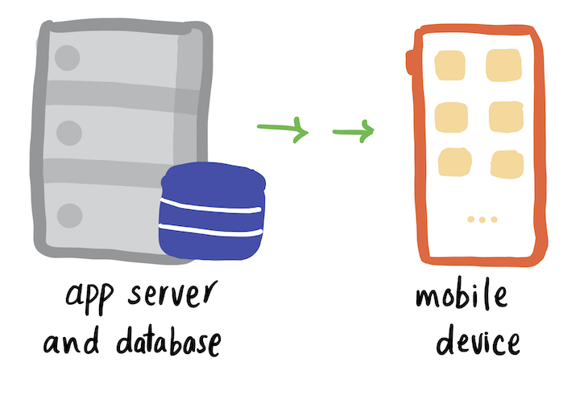
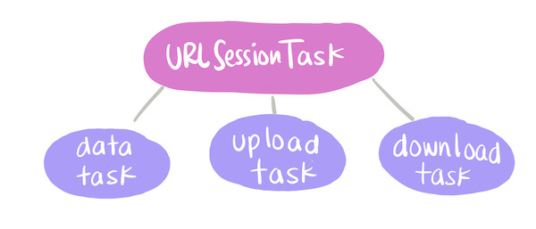
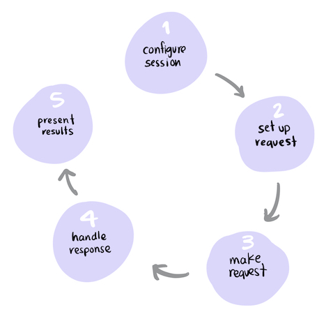
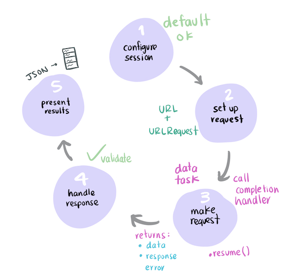

<!-- Run this slideshow via the following command: -->
<!-- reveal-md README.md -w -->


<!-- .slide: class="header" -->

# Network Requests using URLRequest

## [Slides](https://make-school-courses.github.io/MOB-1.3-Dynamic-iOS-Apps/Slides/Lesson7/README.html ':ignore')

<!-- > -->

## Why you should know this



<aside class="notes">
Nearly every iOS app communicates at some point with an Internet component such as a remote web service.

Fetching and processing data between an app and a web service is an essential skill that all iOS developers need to master.

The most commonly-used protocol for communicating with web servers is **HTTP** (and its secure counterpart, HTTPS).

Since iOS 7, Apple has provided **URLSession** and its suite of related components as **a complete networking API** for uploading or downloading content via **HTTP** and HTTPS.
</aside>

<!--
...and its family of related classes...

**HTTP** and **HTTPS** are robust and stable protocols. They have been widely used in web browsers for a long time. They offer several performance and security advantages, as well as a mature base of easy-to-use development and analysis tools.

to make GET and POST network requests...
-->

<!-- > -->

## Learning Objectives

At the end of this class, you should be able to...

1. Implement a simple **HTTP-based request** to a **public Internet API** using the primary components of **URLSession**.
2. Validate HTTP response data and guard against common HTTP error conditions.
4. Display text and images fetched from free web services.

<!-- > -->

## URLSession

 </br>

<aside class="notes">
URLSession is responsible for sending and receiving HTTP requests.

Like most networking APIs, the URLSession API is highly asynchronous.
</aside>

<!-- > -->

### URLSessionConfiguration

Every URLSession instance is initialized using an `URLSessionConfiguration` object, which defines the behavior and policies to use when uploading and downloading data.

`URLSessionConfiguration` will also let you configure additional HTTP headers, timeout values, caching policies, and other session properties.

<!-- > -->

#### Three types:

URLSessionConfiguration objects come in 3 flavors:

1. **.default** - Creates a default configuration object that uses the disk-persisted global cache, credential and cookie storage objects. Can save cache or cookies to disk, credentials to the Keychain.

<!-- v -->

2. **.ephemeral** - Similar to `.default`, but all session-related data is stored in memory and will be gone once the session terminates.

<!-- v -->

3. **.background** -  Allows the session to perform upload or download tasks in the background, even if the app is suspended.

<!-- > -->

Here is a simple example of a declaration of a `URLSession` instance using the `.default` `URLSessionConfiguration` type:

``` Swift
let defaultSession = URLSession(configuration: .default)
```

<!-- > -->

### URLSessionTask

To do the real work of fetching data or downloading/uploading files, a session creates one or more *tasks.*

`URLSessionTask` is the class that contains predefined network task behaviors.

 </br>

<!-- > -->

#### Three types:

The three concrete subclasses of URLSessionTask which you will employ most often are:

1. **URLSessionDataTask** - Intended for short, often interactive server requests such as fetching data by sending HTTP requests (GET, POST, etc). Data tasks send and receive data using `NSData` objects.

<!-- v -->

2. **URLSessionUploadTask** - Similar to data tasks, but also send data (such as a file) from disk to web service, and they support background uploads while the app is no longer running.

<!-- v -->

3. **URLSessionDownloadTask** - Data from a remote service is retrieved in the form of a file and stored in a temporary location. Supports background downloads/uploads while app the isn't running.

<!-- > -->

## Making HTTP GET Requests Using URLSessionDataTask



<aside class = "notes">
The following steps show how to create, send and validate a simple HTTP GET request using a URLRequest object and a URLSessionDataTask instance that returns its URLResponse via a completion handler.
</aside>

<!-- > -->

## Let's make a request - one piece at a time 🧩

Instructions [here](https://github.com/Make-School-Courses/MOB-1.3-Dynamic-iOS-Apps/blob/master/Lessons/Lesson7/assignments/instructions.md)

<!-- > -->

#### The Full Request

Except for handling the response, this code snippet depicts the complete set of steps required to make our simple GET request:

``` Swift

  func someDataFetchFunction() {

        // Configure a .default session
        let defaultSession = URLSession(configuration: .default)

        // Create URL
        let url = URL(string: "https://<your_target_web_service>")

        // Create Request
        let request = URLRequest(url: url!)

        // Create Data Task
        let dataTask = defaultSession.dataTask(with: request, completionHandler: { (data, response, error) -> Void in

          // handle Response Here

        })
        dataTask.resume() // Start the data task
    }
```

<!--

## NASA's picture of the day 🪐

Follow instructions [here](https://github.com/Make-School-Courses/MOB-1.3-Dynamic-iOS-Apps/blob/master/Lessons/Lesson7/assignments/nasa.md).

-->


### Validate the Response

When making network requests with HTTP/S, success or failure can occur at several levels:
- Any errors with the Response?
- Was the expected HTTP Status Code returned?
- Was data returned in the correct format?
- Was a data object returned at all?

<!-- > -->

Handling errors and validating successful state are key to working with the URLSession family of classes and functions.

**Developer Hints:**
- Whether or not all the procedures listed are required or optional depends on your particular implementation of URLSession.
- However, **handling the error** returned and **converting JSON data** should always be considered as **required** steps .

<!-- > -->

### Handle the `error` Object

Check if the `error` object is `nil.` If not, *properly* handle the error (for now, we'll simply print the error returned):

```swift
// guard against any errors with this HTTP response
guard error == nil else {
  print ("error: ", error!)
  return
}
```

<!-- > -->

### Confirm the Data Object

Ensure that a `data` object has been returned with the response:

```swift
// protect against no data returned from HTTP response...
guard data != nil else {
  print("No data object")
  return
}
```

<!-- > -->

### Validate HTTP Status

Confirm that the HTTP Status Code returned falls within the range of acceptable codes. If not, we want to properly respond to the error condition:

```swift
// Confirm the HTTP Status Code is within the range of acceptable ones
guard let httpResponse = response as? HTTPURLResponse, (200...299).contains(httpResponse.statusCode) else {
    print("response is: ", response!)
    return
}
```

<!-- > -->

### Format Validation

Now that we know the response status is good, we can validate the format of the returned data.

The `MIME Type,` a value returned by most web servers, tells us the **format** of the returned data. We want to ensure that the data returned is in the expected format (JSON, in this case):

```swift
// Validate response data is in expected format
guard let mime = response?.mimeType, mime == "application/json" else {
  print("Wrong MIME type!")
  return
}
```

<!-- > -->



<!-- > -->


## HW assignment

[Practicing requests with the Pokemon API + UI](https://github.com/Make-School-Courses/MOB-1.3-Dynamic-iOS-Apps/blob/master/Lessons/Lesson7/assignments/swapi.md)

<!-- > -->

## Interview question

1. `URLSession` objects are *asynchronous.* Research what that means and be able to answer the following question:
- Why do we need to add the following call to `main.async` when presenting an image from a network call:

```swift
DispatchQueue.main.async {
  //A downloaded image placed into an imageView
}
```

<!-- > -->

## Additional Resources

1. [URL Loading System - from Apple](https://developer.apple.com/documentation/foundation/url_loading_system)
2. [URLSession - from Apple](https://developer.apple.com/documentation/foundation/urlsession)
3. [The URLSessionDelegate Protocol - from Apple](https://developer.apple.com/documentation/foundation/urlsessiondelegate)
4. Asynchronicity and URL Sessions:</br>
[From Apple](https://developer.apple.com/documentation/foundation/urlsession)</br>
[From StackOverflow](https://stackoverflow.com/questions/45463996/how-does-urlsessiontask-run)
5. [Error Error Handling In Swift With Do-Try-Catch - an article](https://learnappmaking.com/error-handling-swift-do-try-catch/)
