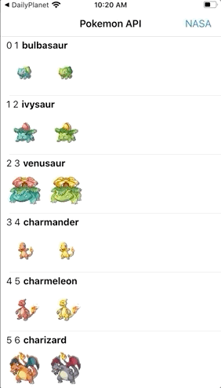

# Pokemon API

Resources needed:
* [The Pokemon API](https://pokeapi.co)

## PART 1

Use the DailyPlanet app as a "canvas" to practice deserializing JSON from an HTTP request:

- Create and call a new function that fetches data from the Pokemon API to fetch a list of Pokemon. This is the endpoint: endpoint: /pokemon
- In your data tasks' completion handler, **convert** the returned `data` object to JSON, and **print** your converted `jsonObject` to the debug console.
- Use a Pokemon struct that conforms to the Codable protocol (it will only have two properties at this point: name and url)
- Handle the HTTP `error` object returned and any other validation you want to include (status, data, etc.)

## PART 2

**Create A Paginating Table View App with JSON Data:**

Create a **table view** app with **pagination** that:
- Uses a cell to present the name of the pokemon from the JSON response returned
- When scrolled to the end of the currently available data, the app must fetch new data to enable pagination.
- Check the section "Resource lists and pagination" straight from the docs: https://pokeapi.co/docs/v2.html/
In the end you will have a table view that keeps on getting new data for Pokemon as you reach the end of the scroll.

## Example implementations

- [Example 1](https://github.com/caocmai/mob1.3-fetching-from-api)

- Example with images in table view

## Inspiration: Sample projects using the Pokemon API

- [Sample 1](https://github.com/tron1991/Pokemon-API-Swift)
- [Sample 2](https://github.com/Frog-Frog/Pokedex)

#### Alternative API: https://swapi.dev

The original assignment used the Star Wars API. If you prefer to use this one instead of the Pokemon API you can do so.

- Using the /people/ endpoint
- Use a cell to present the "name" and 1 other property/items (i.e.. "height") from the JSON response returned
