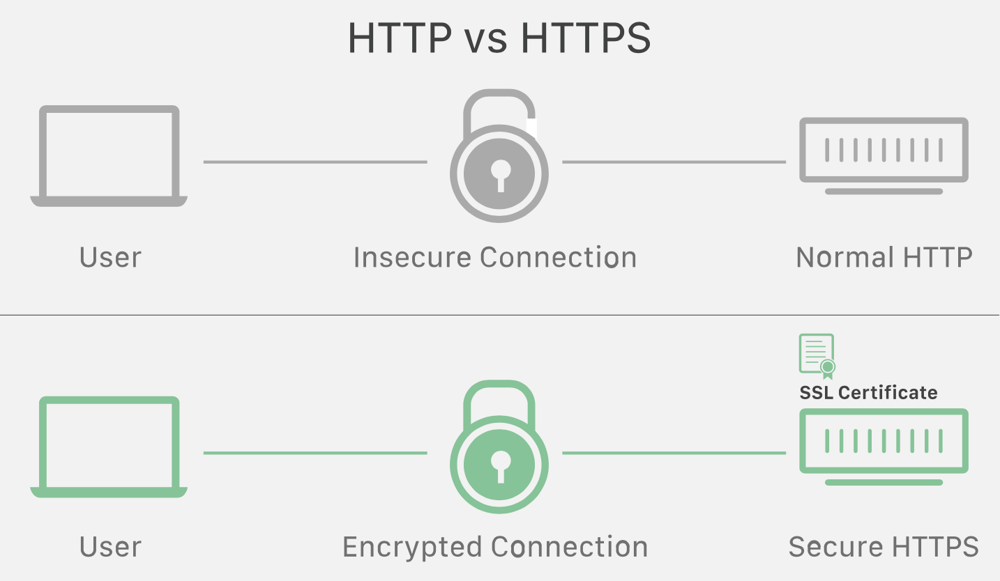

<!-- Run this slideshow via the following command: -->
<!-- reveal-md README.md -w -->

<!-- .slide: class="header" -->

# Requests with Authentication

## [Slides](https://make-school-courses.github.io/MOB-1.3-Dynamic-iOS-Apps/Slides/Lesson8/README.html ':ignore')

<!-- > -->

## Initial activity - 10 min

Open your project from last class. The Pokemon app with the list of pokemon from the API (maybe with pagination included? 😀)

- Show each other's final result.
- In pairs discuss how you coded your solution and share best practices or tips you found along the way.
- If you are blocked with the assignment see if your peer can unblock you, if not ask for assistance during the breakout room.

<!-- > -->

## Why you should know this

As the use of the **HTTP protocol** evolved, so have the efforts of hackers trying to exploit its **many inherent weaknesses**.

In fact, HTTP is such an insecure protocol that Apple has all but prohibited its use in iOS apps.

Over the last few releases of iOS, Apple has redesigned iOS's networking frameworks to work natively with **HTTP's secure counterpart: HTTPS.**

<!-- > -->

And the primary difference between HTTPS and HTTP?

- *HTTPS requires Authentication.*

Thus, every iOS developer *must* know how to implement HTTPS-based network calls with Authentication.

<!-- > -->

## Learning Objectives

1. Make authenticated API requests.
2. Distinguish between OAUTH and API Key security models.
3. Identify network layer in Product Hunt Tutorial

<!-- > -->

<!--## Initial Exercise (15 min)

**Structured Sharing Exercise - Part 3 from last class**

- Come up and review the sheets from last class.
- Select the one or two sheets you agree with most.

In Groups of 3 - (8 min)
- Share your thoughts about your selection.

As A Class - (6 min)
- We'll choose 3 review topics. Volunteers to explain each.
-->

## Network Authentication for iOS

There can be a variety of options for securing network communications over HTTPS, ranging from very simple to complex ones such as SAML or OAUTH login implementations.

Authentication for HTTPS comes in two distinct implementation types:

- **OAUTH** - Is an "authorization framework that enables third-party applications to obtain limited access to a web service."
- **API Keys**

<!-- > -->

## Collaborative activity

[Let's compare both](https://docs.google.com/presentation/d/1V86TRQuRhsrRWlR_aZPI6KV0ZRhGlHbj40MpfUCPbG8/edit?usp=sharing)

<!-- > -->

## PhotoMatic App

Resources needed:

- Download [The PhotoMatic starter app](https://github.com/VanderDev1/PhotoMatic_Starter.git)
- An API Key for the Flickr photo web service
- The Flickr webservice endpoint URL and the name of the method required to access Flickr's free library of Interesting Photos.

<!-- > -->

### Part 1

For this activity, we are going to access the Flickr photo sharing and management web service.

But we'll need to obtain an API KEY from Flickr. Here's how:

<!-- > -->

#### FIRST STEP: Create A Flickr Account

1. Access the [Flickr API main page](https://www.flickr.com/services/api/)

2. Then click on the API Keys URL to bring up the Login screen:

<!-- > -->

3. Find and select the `Not a Flickr member? Sign up here.` link at the bottom of the Login dialog box

- Then, click the `I want to create a new Yahoo email address` and **use your Make School email address.**

<!-- > -->

4. After you create your account, you will need the API Keys URL again to apply for a key.

5. When prompted with the selection page, choose "Apply For Non-Commercial Key"

...and you should be presented with your brand-new, Flickr API Key!

<!-- > -->

### Part 2 - As A class

For this exercise, we need:

- [The PhotoMatic starter app](https://github.com/VanderDev1/PhotoMatic_Starter.git)
- A valid Flickr API Key
- The base url for the Flickr API:
https://api.flickr.com/services/rest
- The Flickr method to call to download Interesting Photos: `flickr.interestingness.getList`

...and one student volunteer to "drive"

<!-- > -->

1. **STEP 1** - Run the starter app
- it will fail. Why?

2. **STEP 2** - Let's fix it 🔨

<!-- TOODO: add section on Copyright, license, cost, restrictions, etc.  -->

<!-- TOODO: show Flickr license page graphic? and URL? -->

<!-- > -->

### Part 3 - In Pairs

In 5 minutes, examine the code in the [The PhotoMatic starter app](https://github.com/VanderDev1/PhotoMatic_Starter.git)

**Q** With respect to MVC, what do you notice about the code in this app? 
**Q** What might you do restructure it to optimize its readability, adherence to MVC, and so on?

<!-- > -->

## Challenge - 20 min

Add an **Activity Indicator** (aka, a "spinner") to the project so that while every images is being downloaded the user is presented with a spinner indicating the network request for each image is in progress.

<!-- > -->

## Product Hunt Check in - 10 min

- Understanding the Network module

<!-- > -->

## Additional Resources

1. [HTTPS image](https://www.cloudflare.com/learning/ssl/why-is-http-not-secure/)
2. [OAUTH](https://hackernoon.com/mobile-api-security-techniques-682a5da4fe10)
3. [Apple Sign in](https://developer.okta.com/blog/2019/06/04/what-the-heck-is-sign-in-with-apple)
