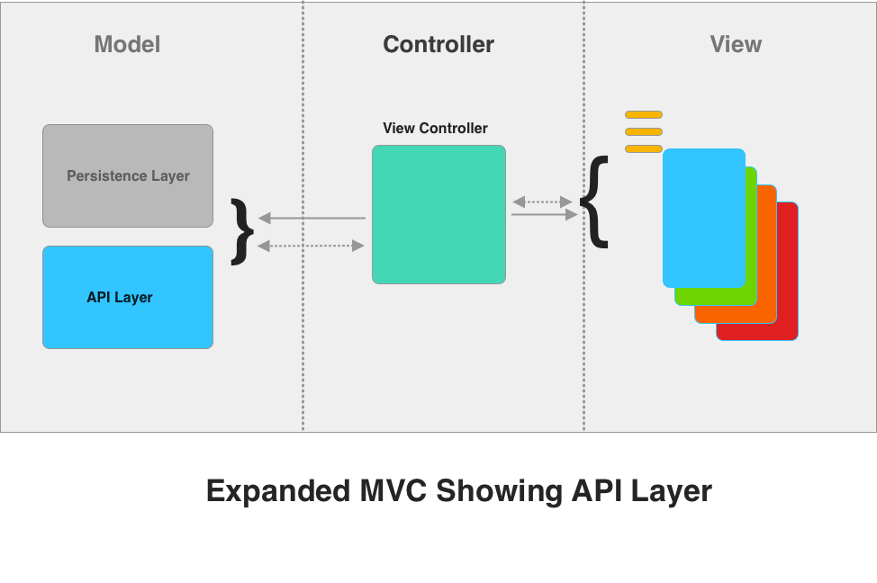
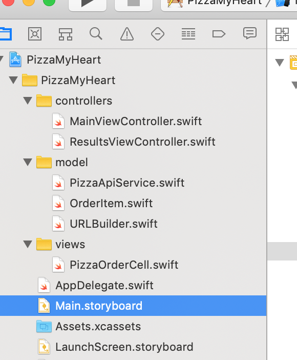

# Building a Networking Domain

## Minute-by-Minute

| **Elapsed** | **Time**  | **Activity**                        |
| ----------- | --------- | ----------------------------------- |
| 0:00        | 0:05      | Objectives                          |
| 0:05        | 0:20      | Initial Exercise                    |

| 0:x        | 0:xx      | BREAK                               |
| 0:x        | 0:x      | In Class Activity I                 |
| 1:20       | 0:15      | xxx |
| 1:35        | 0:20      | In Class Activity II                |
| 1:45        | 0:05      | Wrap Up                             |
| TOTAL       | 1:50      |                                     |


## Why you should know this

xxx

<!-- puts request logic into a separate object, and we call this object a store (Figure 28.4). Using a store object minimizes redundant code and simplifies the code that fetches and saves data. Most importantly, it moves the logic for dealing with an external source into a tidy class with a clear and focused goal. This makes code easier to understand, which makes it easier to maintain and debug, as well as share with other programmers on your team.

-->


## Class Learning Objectives/Competencies (5 min)
At the end of this class, you should be able to...

1. xxx
2. xxx


## Initial Exercise (20 min)

### As A Class

**Quizlet Game**


## Overview


### Domain Model

**A Definition**</br>
In software engineering, a **domain model** is a conceptual model of the domain that ___incorporates both behavior and data.___ <sup>[1](#footnote1)</sup>

**Implementation is in Layers**</br>
A domain model is commonly implemented as an **[object model](https://en.wikipedia.org/wiki/Object_model)** - *a collection of objects or classes through which a program can examine and manipulate specific parts of its world.*<sup>[1](#footnote1)</sup>

It is typically comprised of:<sup>[1](#footnote1)</sup>
1. A lower-level **persistence layer**
2. A higher-level **API layer** to gain access to the data and behavior of the model.




In this class, we will expand our proficiency with MVC by implementing an ___API Layer___ designed to manage access to the data and functionality of the *Model* layer.
</br>

### Key Application Design Principles

As a design pattern, MVC seeks to promote two important design principles fundamental to OOP:

1. **Separation of Concerns (SoC)** - Represents a ___modular___ approach to constructing an application in which code can be separated into logical sections, each addressing separate areas of functional behavior (concerns). SoC results in higher degrees of freedom for because it hides the need for a given section to know particular information addressed by other sections.

 - MVC can separate content from presentation and data-processing (model) from content.
 - Service-oriented design can separate concerns into services.

 2. **Reusability** - If correctly implemented, view and model layers can easily be composed of reusable, modular components (though controllers are seldom reusable).


### MVC's Current State

As the complexity of iOS app development evolves, design patterns have emerged to address shortcomings of the standard MVC model. The hype of many promising new iOS architectures can be misleading.

As a developer, you need to be aware of the pros and cons of emerging iOS design patterns such as:

1. **Model-View-ViewModel pattern (MVVM)** - Like MVC, but it adds a fourth component - the ___view model.___ The view model is responsible for managing the model and passing data to view controllers in a format ready to be displayed on the screen, relieving controllers of these responsibilities.

2. **View-Interactor-Presenter-Entity-Routing (VIPER)** - Expands MVC to include intermediary components which handle specific tasks and reduces interaction with the model, view and controller to a single point of contact. For example, views and view controllers now only detect user interaction and display data; the Presenter responds to user interaction information received from the controller, fetches and prepares data for presentation.

3. **Model-View-Controller-Store (MVCS)** - An expansion on MVC in which data request logic is moved out of the controller and into separate modules/objects specifically designed to fetch the data, regardless of where the data comes from (from a server, local file, a database, etc).
- This could also be thought of as ___"Model-View-Controller-Service,"___ where a *service layer* handles fetching and processing data.


But behind them all is simply the principle of **Separation of Concerns** being applied in specific ways to MVC...


### Project Organization

Structure and organization are key contributors to effective modularized architecture.

Creating groups folder is a great place to start.

*Note that controllers, views, and model are only suggestions - feel free to name yours whatever makes sense in your project.*





### Service Objects

The core component of our API Layer is the **Service** or **API object.**

It's the job of this object to:

- Fetch, post and process data to and from the target web services
- Serialize JSON data for manipulation and presentation
- Provide constructs for handling the successful or failed state of web service requests and responses


### The Model Object


Sometimes referred to as a ___Transfer Object___ (or a ___TO__), a ___Value Object___, or a ___Data Transfer Object (DTO)___, model objects are an important component of efficient network service and data persistence layers.

Model objects most often represent in software - or “model” - a single, simplified instance of a *thing* that exists in the real world such as a person, product, transaction, and so on.

Model objects can be passed around your code and used to simplify data manipulation in a variety operations:
- data retrieval (fetch)
- data storage/persistence
- user presentation (for example, to populate individual table cell data)

…and much more.

This is a classic, simple example of a `user` represented (modeled) as a Codable struct with 3 properties:

```Swift
struct User:Codable {
    var first_name:String
    var last_name:String
    var country:String
}
```


## In Class Activity I (20 min)

Required resources:
1. Download the base app, [PhotoMatic](https://github.com/VanderDev1/PhotoMatic_L09.git)

**Individual**

__Scenario:__
- Congratulations! You just got hired at a new firm. But you "inherited" code created by several previous developers who no longer work at the company.
- The app was written in an older version of Swift.
- It was originally created as a quick “prototype” (i.e., it was not designed with maintenance and extension in mind), and it was developed by engineers new to both iOS and Swift.

**TODO:** Using what you’ve learned so far about iOS networking, your assignment is to:
- Refactor the code so that it (a) is scalable, and (b) adheres to the tenets of MVC
- Where you see quick and practical opportunities, update the code to Swift 4 constructs, including implementing model objects with the `Codable` interface, properly handling Optionals and errors, and so on...

**Steps to Complete**

1. Validate the App - Insert your own Flickr API Key and confirm the *current working state* of the app.

2. Refactor (or move) all **network calls** and **JSON processing functions** into the **PhotoFetchService**.

3. Recreate the model object (`Photo.swift` class) to implement the Codable interface.
- Note the impact this change may have to other part of the code base.

4. Review any other opportunities to improve the app (i.e., handling optionals, etc.). If time permits, make those improvements.


<!-- Insert code here -->
## HTTP Post Requests

To add a new item to a web service, we use the HTTP protocol's **POST method.**

Implementing a POST request is a bit like performing a GET request in reverse, except that for a POST you will need to supply additional parameters to the URLRequest object.

Commonly required parameters include:

- The __httpMethod type__ (i.e., “POST”)
- The __content type__ (JSON, in our case)
- Or any other __headers__ specifically required by your target web service API (a valid API Key, for example)


### Step 1: Set Up the Session and Requests

Just as we did with our HTTP GET request, we first need to create and configure a **URLSession** and a **URLRequest** object that points to our target web service **URL.**

```Swift
  let session = URLSession.shared
  let url = URL(string: "https://<your_web_service_url>")
  var request = URLRequest(url: url!)
```


<!-- Insert code sample here -->

### Step 2: Configure the Request

#### Specify the httpMethod type

For any web service request other than GET (i.e., POST, PUT, PATCH, DELETE), we need to specify the **httpMethod** to invoke.

Since we are performing a POST here, we will set the httpMethod property to `urlRequest = "POST"`.

```Swift
  request.httpMethod = "POST"
```

#### Specify Headers

Next, use the URLRequest `setValue(_:forHTTPHeaderField:)` method to set the values of any HTTP headers you want to provide (except the `Content-Length` header. The session automatically figures out content length  from the size of your data).

___`Content-Type`___

We use `Content-Type` header to indicate to the web service API the type of data we are sending.

In our case, we want to set the `Content-Type` to `JSON`.

```Swift
  request.setValue(“application/json”, forHTTPHeaderField: “Content-Type”)
```

___`Accept`___

The `Accept` request header field is used to specify certain **media types** that are acceptable for the **response** object returned by the web service.

We want our response to be returned as JSON, so we set the `Accept` request header field to return JSON.

```Swift
  request.setValue(“application/json”, forHTTPHeaderField: “Accept”)
```

___Other Header Fields___

Follow the same process of using the URLRequest `setValue(_:forHTTPHeaderField:)` method to supply all header fields required for communicating with your target web service.

A valid API Key is commonly required for the "Authorization" header field:

```Swift
    request.setValue("<insert_valid_API-KEY_here>", forHTTPHeaderField: “Authorization”)
```


###  3: Convert Data to JSON Format

To convert our data object to the JSON format, we will use a built-in function of `JSONSerialization:`

 ```Swift
 JSONSerialization.data(withJSONObject obj: Any, options opt: JSONSerialization.WritingOptions = []) throws
```

*What exactly does this function do?* Here is a brief excerpt from Apple's description:

*Generate JSON data from a Foundation object. If the object will not produce valid JSON then an exception will be thrown. Setting the NSJSONWritingPrettyPrinted option will generate JSON with whitespace designed to make the output more readable. If that option is not set, the most compact possible JSON will be generated. If an error occurs, the error parameter will be set and the return value will be nil...*

We convert our data into JSON, then include the converted JSON data into the httpBody of the URL request and handle any errors thrown.

```Swift
let parameters: [String: Any] = [“foo”: “bar”, “numbers”: [1, 2, 3, 4, 5]]
       do {
           let jsonParams = try JSONSerialization.data(withJSONObject: parameters, options: [])
           postRequest.httpBody = jsonParams
       } catch { print(“Error: unable to add parameters to POST request.“)}
```

The `options` array is left blank here, but it can be used to print or to sort the output (see Apple references below for more details).


### Step 4:  Execute Request

Finally, the dataTask will execute our POST request with the our specified header values, and its completion block closure will be executed after the response is returned from the web service.

```Swift
URLSession.shared.dataTask(with: request, completionHandler: { (data, response, error) -> Void in
           if error != nil { print(“POST Request: Communication error: \(error!)“) }
           if data != nil {
               do {
                   let resultObject = try JSONSerialization.jsonObject(with: data!, options: [])
                   DispatchQueue.main.async(execute: {
                       print(“Results from POST request:\n\(resultObject)“)
                   })
               } catch {
                   DispatchQueue.main.async(execute: {
                       print(“Unable to parse JSON response”)
                   })
               }
           } else {
               DispatchQueue.main.async(execute: {
                   print(“Received empty response.“)
               })
           }
       }).resume()
```

**Note:** This example uses the alternate ___shared___ dataTask type: `URLSession.shared.dataTask()`

#### Putting It Altogether

The complete code for an HTTP POST request function would resemble this:

```Swift
        let session = URLSession.shared
        let url = URL(string: "https://<your_web_service_url>")
        var request = URLRequest(url: url!)

        request.httpMethod = “POST”
        request.setValue(“application/json”, forHTTPHeaderField: “Content-Type”)
        request.setValue(“application/json”, forHTTPHeaderField: “Accept”)
        request.setValue(“<insert_valid_API-KEY_here>”, forHTTPHeaderField: “Authorization”)

        let parameters: [String: Any] = [“foo”: “bar”, “numbers”: [1, 2, 3, 4, 5]]
            do {
                let jsonParams = try JSONSerialization.data(withJSONObject: parameters, options: [])
                request.httpBody = jsonParams
            } catch { print(“Error: unable to add parameters to POST request.“)}

        URLSession.shared.dataTask(with: request, completionHandler: { (data, response, error) -> Void in
            if error != nil { print(“POST Request: Communication error: \(error!)“) }

            if data != nil {
                do {
                    let resultObject = try JSONSerialization.jsonObject(with: data!, options: [])
                    DispatchQueue.main.async(execute: {
                        print(“Results from POST request:\n\(resultObject)“)
                    })
                } catch {
                    DispatchQueue.main.async(execute: {
                      print(“Unable to parse JSON response”)
                    })
                }
            } else {
                DispatchQueue.main.async(execute: {
                    print(“Received empty response.“)
                })
        }
        }).resume()
```


## The Request Builder

The **Builder** design pattern is a type of **Creational** design pattern that is used to create complex objects step-by-step.

It offers:
- ___Flexibility___ - Easily create different representations of the same complex object
- ___Simplicity___ - Simplifies the creation of a complex object.

HTTP request methods GET, POST, DELETE, and so on, are constructed using parameters common to them all. Thus, HTTP requests offer a prime opportunity to employ the Builder pattern to create different types of request objects with commonly shared parameters.

Instead of rewriting the parameters for a separate request object for each HTTP method, a more efficient design is to design a single RequestBuilder object that reuses the commonly shared reqeust parameters, then call a separate function on the RequestBuilder object to create a request for a GET or a POST, respectively.

<!-- Insert code sample here -->


## Best Practices

<!-- Best Practices for Network Architecture
keep controllers light and focused on its job
when adding anything, ask yourself “does this functionality really belong in the controller
keep model out of controllers
API Keys:
store API keys in Plist
add to headers is safer than appending
TODO: research why?
code reuse
simple, modular building blocks of specialized objects
model objects
Codable interface
TODO: research why?


Ultimately, as your app development experience evolves with the ever-changing iOS practices, you will want to arrive at your own set of best practices...


https://github.com/futurice/ios-good-practices
futurice/ios-good-practices
-->


## Challenges

1.
<!-- apply best practices (saving API Key as a plist)
- add spinner> [action]
>
> add Unit test for testing one Failed case when network is not present
learn how to simulate network disconnect to validate this
-->


## Wrap Up (5 mins)


## Additional Resources

1. [Slides]
2. <a name="footnote1"><sup>1</sup></a>[Domain model - A Wikipedia article](https://en.wikipedia.org/wiki/Domain_model)
3. [xxx]()


<!-- xxx -->


https://en.wikipedia.org/wiki/Separation_of_concerns
https://medium.com/yay-its-erica/intro-to-the-viper-design-pattern-swift-3-32e3574dee02

[Apple on JSONSerialization reading and writing options]
https://developer.apple.com/documentation/foundation/jsonserialization/writingoptions

https://developer.apple.com/documentation/foundation/jsonserialization/readingoptions
